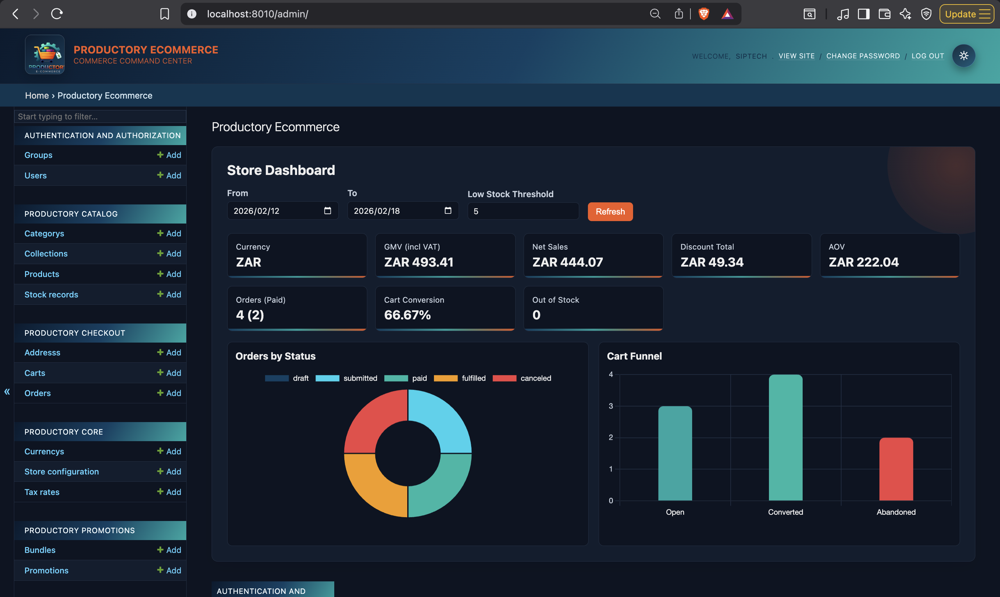
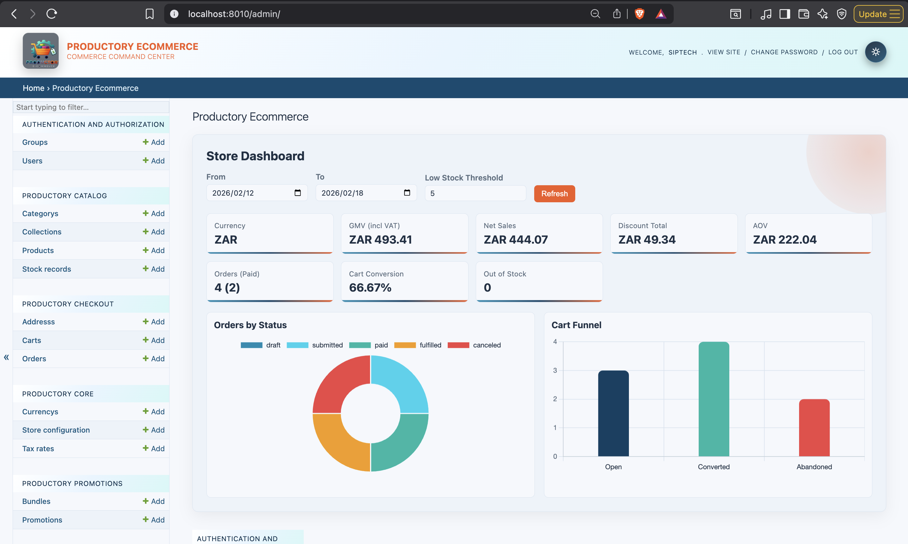

# Productory E-commerce

[](https://github.com/SipTech/productory/actions/workflows/ci.yml)
[](https://pypi.org/project/productory-ecommerce/)
[](https://pypi.org/project/productory-ecommerce/)
[](https://www.djangoproject.com/)
[](LICENSE)

Reusable Django e-commerce building blocks with a working demo: catalog, checkout/orders, promotions, and store pricing config.




## Why Productory

- Package-first architecture (`src/`) you can install into your own Django project
- Service-layer business logic (pricing, checkout, order transitions) instead of fat views
- DB-backed store defaults for currency, timezone, VAT, and VAT-inclusive/exclusive pricing
- Working demo project (`demo/`) with seeded realistic data and branded admin KPI dashboard
- Clear extension points: hooks/signals, optional webhooks, and custom pricing orchestration

## Try It In 2 Commands

```bash
make install-dev
make demo-run
```

`make install-dev` bootstraps a local `.venv` and installs dev dependencies into it.

Then:

- Catalog products API: `http://127.0.0.1:8010/api/catalog/products/`
- Checkout carts API: `http://127.0.0.1:8010/api/checkout/carts/`
- Promotions API: `http://127.0.0.1:8010/api/promotions/promotions/`
- Create admin: `make superuser`
- Admin dashboard: `http://127.0.0.1:8010/admin/`

`make demo-run` builds containers, applies migrations, and seeds:

- 10 categories
- 10 collections
- 50 products
- stock records (qty 5-10)
- 6 bundles
- 5 active promotions (valid through month end)
- 10 addresses
- 32 carts (open/converted/abandoned mix)
- 18 orders (submitted/paid/fulfilled/canceled mix)

Default store config seeded in DB:

- currency: `ZAR`
- timezone: `Africa/Johannesburg`
- VAT: `15%`
- pricing mode: VAT-inclusive by default

Useful commands:

```bash
make demo-logs
make demo-stop
make loaddata
make test
make test-all
```

## API Surface

Mounted under `path("api/", include("productory_ecommerce.urls"))`:

- `/api/catalog/` -> `productory_catalog`
- `/api/checkout/` -> `productory_checkout`
- `/api/promotions/` -> `productory_promotions`
- `/api/internal/` -> `productory_core` (staff-only KPI endpoint)

## Install In Your Django Project

```bash
pip install productory-ecommerce
```

Optional Postgres driver:

```bash
pip install "productory-ecommerce[postgres]"
```

```python
from django.urls import include, path

INSTALLED_APPS = [
    "rest_framework",
    "django_filters",
    "productory_core",
    "productory_catalog",
    "productory_checkout",
    "productory_promotions",
]

urlpatterns = [
    path("api/", include("productory_ecommerce.urls")),
]
```

## Architecture


## Entity Relationship Diagram


## ERD Legend (Plain English)

- `Category`: A product group (for example: Coffee Beans, Mugs).
- `Collection`: A curated shelf of products (for example: Best Sellers, New Arrivals).
- `Product`: A single item you sell with a SKU, price, and currency.
- `StockRecord`: The current inventory level for one product.
- `ProductImage`: Images shown for a product.
- `Bundle`: A packaged offer made from multiple products sold together at a bundle price.
- `BundleItem`: The link that says which products are inside a bundle and in what quantity.
- `Promotion`: A discount rule (percentage or fixed amount) that can target products, bundles, or all products.
- `Cart`: A shopper’s active basket before checkout.
- `CartItem`: One product line inside a cart (with quantity and captured unit price).
- `Order`: The finalized purchase created from a cart at checkout.
- `OrderItem`: One line in the order snapshot, preserving what was bought and at what price.
- `Address`: Shipping and billing details attached to orders.
- `Currency`, `TaxRate`, `StoreConfig`: Store-wide defaults that control money format, VAT/tax, and pricing behavior.
- `AuditEvent`: A timeline entry that records what changed, who changed it, and when it happened.

How it all connects in practice:

- You organize products with categories and collections.
- Products have stock and images.
- You can sell products directly, or group them into bundles.
- Promotions can discount products and bundles.
- A customer adds products to a cart.
- Checkout turns the cart into an order.
- Orders keep a snapshot of purchased items and pricing, plus shipping/billing addresses.
- Store configuration provides the currency and tax rules used during pricing and checkout.
- Every important pricing/ops record writes to the audit trail so admins can review change history.

## Audit Trail

Tracked models with signal-based audit logging:

- `Currency`
- `TaxRate`
- `StoreConfig`
- `Order`
- `StockRecord`
- `Bundle`
- `Promotion`

Each `AuditEvent` stores:

- `what changed`: field-level before/after values (or relation updates)
- `who changed it`: authenticated actor when available
- `when`: event timestamp

## Repo Layout

```text
.
├── src/                 # installable Productory Django apps
├── demo/                # demo Django project
├── tests/               # pytest suite
├── docs/                # guides, API examples, diagrams, branding
├── docker-compose.yaml  # local docker stack (demo + postgres)
├── Dockerfile           # demo app image
├── Makefile             # primary command interface
└── pyproject.toml       # package metadata + tooling config
```

## Docs

- [Quickstart](docs/quickstart.md)
- [Concepts](docs/concepts.md)
- [API Examples](docs/api-examples.md)
- [Extension Points](docs/extension-points.md)
- [Branding](docs/branding.md)
- [Productory Ecommerce](docs/productory-ecommerce.mmd)
- [Productory Ecommerce-erd](docs/productory-ecommerce-erd.mmd)

## Contributing

See `CONTRIBUTING.md`.

## Codeowner

Made with 🖤 by [**SipTech**](https://github.com/SipTech/) @ 2024 - 2026

## License

Apache-2.0.
