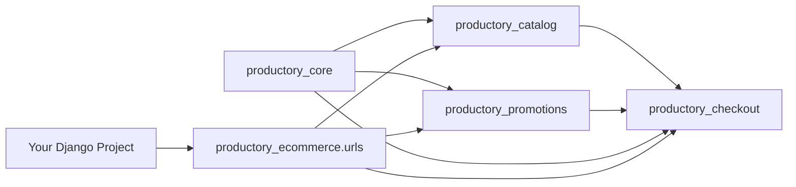

# Productory E-commerce

Productory is a complete rewrite as reusable Django apps for catalog, checkout, orders, and promotions.

## What this repo is

- Package-first Django OSS project
- Source code in `src/`
- Demo project in `demo/`
- Tests in `tests/`
- Single code path: package modules + demo project only

## High-level repo layout

```text
.
├── src/                 # installable Productory Django apps
├── demo/                # demo Django project
├── tests/               # pytest suite for package apps
├── docs/                # guides, API examples, branding
├── .devcontainer/       # dev container config
├── docker-compose.yaml  # local docker stack (demo + postgres)
├── Dockerfile           # demo app image
├── Makefile             # primary developer/ops command interface
└── pyproject.toml       # package metadata + tooling config
```

## Quickstart

```bash
make install-dev
make demo-run
```

`make demo-run` starts the demo containers in detached Docker mode and applies migrations.
It also seeds demo data:
- 10 categories
- 10 collections
- 50 products
- stock records (qty 5-10)
- 6 bundles
- 5 promotions (valid now until month end)

Default store configuration is database-backed:
- currency: `ZAR`
- timezone: `Africa/Johannesburg`
- VAT: `15%` with prices treated as VAT-inclusive by default

Open `http://127.0.0.1:8010/api/` (default from `.env.example`).
Open `http://127.0.0.1:8010/admin/` for the Django admin dashboard landing page with KPI cards and charts.

```bash
make demo-logs
make demo-stop
make loaddata
```

Update store config in Django admin:
- `Currency`
- `TaxRate`
- `Store configuration`

## Dev Container

If you use VS Code Dev Containers, open the repo in container and it will run `make install-dev` automatically.

Then run:

```bash
make demo-run
```

## Docker workflow

```bash
make up
make migrations
make loaddata
```

Use `ENV_FILE=.env` to override defaults, for example: `make ENV_FILE=.env up`.

Useful commands:

```bash
make logs
make test
make test-all
make drop-create-db
make down
```

## Install in your Django project

```bash
pip install productory-ecommerce
```

```python
INSTALLED_APPS = [
    "rest_framework",
    "django_filters",
    "productory_core",
    "productory_catalog",
    "productory_checkout",
    "productory_promotions",
]

urlpatterns = [
    path("api/", include("productory_ecommerce.urls")),
]
```

## Architecture



## Docs

- `docs/quickstart.md`
- `docs/concepts.md`
- `docs/api-examples.md`
- `docs/extension-points.md`
- `docs/branding.md`

## Contributing

See `CONTRIBUTING.md`.

## Codeowner

[**SipTech**](https://github.com/SipTech/)

## License

Apache-2.0.
